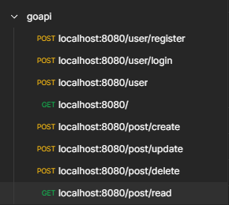

**Go API With JWT - GAPI**

***

```bash
go mod tidy
go run gapi.go
```

***
I don't want write read me anymore, you can look at the code if you want.



[](https://app.getpostman.com/run-collection/11720765-745c5b5d-b94e-4279-b55e-31b27d12c5a2?action=collection%2Ffork&collection-url=entityId%3D11720765-745c5b5d-b94e-4279-b55e-31b27d12c5a2%26entityType%3Dcollection%26workspaceId%3Dc6d9429e-0ef1-40c2-bf9d-22a951886439)